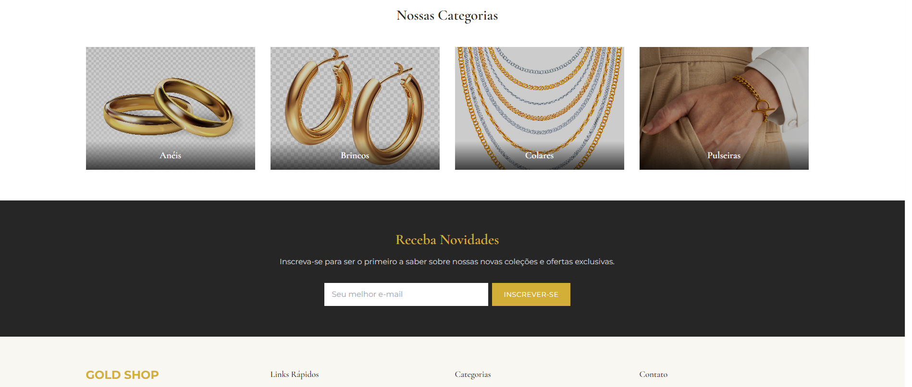

# Integrantes do Grupo:
-Alexandre José Gomes - 1986088  
-João victor Colussi - 2003753

## 🛍️ Gold Shop

Gold Shop é uma vitrine virtual de joias desenvolvida em **React + TypeScript + Vite**, com estilização utilizando **Tailwind CSS**.  
O projeto simula uma loja online com páginas de coleção, detalhes de produtos e botão para adicionar ao carrinho.

## 🚀 Tecnologias utilizadas

- React
- TypeScript
- Vite
- Tailwind CSS
- React Router DOM
- Lucide React Icons

## 📁 Estrutura de Pastas

```
project/
├── public/               # Arquivos públicos (imagens, favicon)
├── src/
│   ├── components/       # Componentes reutilizáveis
│   ├── hooks/            # Hooks personalizados
│   ├── pages/            # Páginas (Home, Collection, ProductDetail)
│   ├── styles/           # Estilos globais (Tailwind)
│   └── main.tsx          # Entrada principal da aplicação
├── index.html
├── package.json
└── vite.config.ts
```

## 💻 Como executar

```bash
npm install
npm run dev
```

Acesse em: http://localhost:5173

## 🧪 Funcionalidades

- Listagem e visualização de produtos
- Detalhes com galeria de imagens e botão de carrinho
- Navegação entre categorias (Aneis, Colares, Pulseiras)
- Layout responsivo e moderno

## 📦 Melhorias futuras

- Integração real com API e backend
- Funcionalidade de carrinho completo
- Autenticação de usuário e checkout

## 📝 Licença

MIT 


## 📝 Imagens do projeto

### Home


### Mid


### Footer

